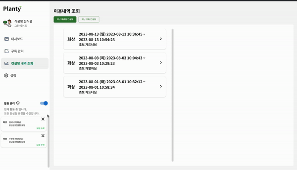
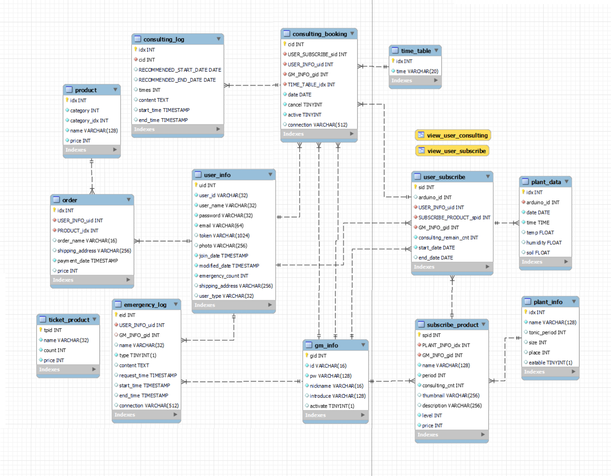

# :four_leaf_clover:PLANTY:four_leaf_clover:
#### 실시간 화상 채팅을 통한 홈가드닝 컨설팅 서비스
<br />
<br />
<br />

# 목차
1. [프로젝트 소개](#프로젝트-소개)
2. [주요 기능](#주요-기능)
3. [서비스 화면](#서비스-화면)
5. [개발 환경](#개발-환경)
6. [설계 문서](#설계-문서)
7. [팀원 소개](#팀원-소개)
<br />
<br />
<br />

# 프로젝트 소개
## :clapper: 기획 배경

현대, 아마존, 페이스북, 구글 등 많은 기업들이 사무 공간에 자연을 적극적으로 도입하고 있으며 트랜드가 되어가고 있습니다. 현대 사회에서는 고도화된 경쟁, 급격한 변화, 디지털화된 생활 등으로 인해 많은 사람들이 높은 스트레스를 경험하고 있습니다. 이에 따라 정신적인 안정과 평온함을 찾는 데 관심을 두는 사람들이 증가하고 있습니다. 특히 홈가드닝은 관심을 끌며 일상에서 자연과 소통하며 스트레스를 해소하는 방법으로 주목받고 있습니다.

## :grey_question: 문제점
- 기존 서비스는 현재 소비자들의 니즈를 충족하지 못해요
- 식물을 어떻게 키워야하는지에 대한 셍소헤요
- 수 많은 정보 속에서 검증된 정보 접근이 어려워요
- 직장, 일 등 바쁜 현대 사회속에서 식물에 대한 정보를 수집할 시간 부족해요
- 무겁고 뿌리내려 진단받으러 이동하기 어려워요

## :newspaper: 서비스 제안
"실시간 화상 채팅을 통한 홈가드닝 컨설팅 서비스 **PLANTY**는 스트레스를 경감하고 정서적 안정을 찾기 위한 사람들에게 자연과의 소통을 통한 치유할 수 있도록 홈가드닝 컨설팅을 제공하는 서비스입니다. 이 서비스는 정기 구독 컨설팅, 응급실 두 가지 핵심 기능을 가지며, 현대 사회의 스트레스와 성공적인 홈가드닝 대한 고민을 해결해 나갈 것입니다.

**1. 정기 구독 컨설팅** 
  - 실시간 화상 채팅 컨설팅

    - 사용자들은 전문 홈가드닝 컨설턴트와 실시간 화상 채팅을 통해 식물 관리에 대한 조언, 가이드, 질문에 답을 받을 수 있습니다. 직접적인 상담을 통해 사용자는 더욱 자신감을 가지고 식물을 키울 수 있을 것입니다. 각 사용자의 환경과 선호도에 따라 식물 선택, 관리 방법, 치유 효과 등을 맞춤형으로 제공합니다. 또한 대기 온습도와 흙의 온습도를 실시간으로 파악하여 정밀한 진단을 제공합니다. 이를 통해 사용자들은 자신의 상황에 맞게 치유 농업을 체험하며 스트레스를 더욱 효과적으로 해소할 수 있을 것입니다.
  
  
  <br>

  - 켈린더를 통한 주기적인 예약 시스템
    
    - 날짜별 30분 단위로 컨설팅을 예약할 수 있습니다.

  <br>

  - IoT를 활용한 실시간 온습도 데이터 제공
    
    - 아두이노를 통해 실시간으로 대기 온습도와 흙의 습온도를 차트로 시각화하여 나타냅니다. 

**2. 응급실**
- 24시간 서비스 제공
  - 24시간 내내 아무 때나 이용 가능한 응급실 서비스가 제공됩니다. 상주하고 있는 그린메이트라는 담당 전문가가 배정되어 급한 상황에서도 사용자들에게 빠른 식물 가이드와 조언을 제공합니다. 이 서비스를 통해 사용자들은 예기치 않은 문제에 대처하며 식물을 적절하게 돌볼 수 있습니다. 이는 사용자들이 식물을 키우는 과정에서 자신감을 높이고 더 나은 결과를 얻을 수 있도록 돕는 중요한 부분입니다.
  
  <br>

- 화상 채팅 서비스


<br />
<br />
<br />

# 사용자 화면

## 컨설팅 예약 및 예약 취소


- 내 구독 상품 중 예약대기 상태라면 예약할 수 있어요.
- 컨설팅 날짜와 시간을 선택해서 예약할 수 있어요.
- 켈린더에 초록색 원을 통해 예약 날짜를 확인할 수 있어요.
- 진행되지 않은 예약은 취소가 가능합니다.
<br>
<br>
<br>

## 내 구독 상품 상세정보 


- 내가 구독한 상품 목록을 확인할 수 있어요.
- 예약완료 상태면 컨설팅을 이용할 수 있어요
- 예약대기 상태라면 예약할 수 있어요.
- 아두이노를 통해 대기 온습도와 흙 온습도 정보를 얻습니다.
- chart.js 라이브러리로 데이터를 시각화하여 정보를 가시적으로 확인할 수 있습니다.
<br>
<br>
<br>

## 구독샵 


- 전체 구독 상품 조회할 수 있어요
- 각 구독 상품의 구독기간, 난이도, 가격를 확인할 수 있어요
- 각 구독 상품의 상세정보를 조회할 수 있어요
- 구독 상품을 구매할 수 있습니다.
<br>
<br>
<br>

## 응급실 이용


- 응급실 이용권을 구매할 수 있어요.
- 이용권 통해서 응급실 참여할 수 있어요.
- 응급실 참여 시 티켓 개수는 차감돼요.
<br>
<br>
<br>

## 마이페이지


- 내 구독 상품 목록을 전체적으로 볼 수 있어요.
- 내 예약 정보를 확인할 수 있어요
- 응급실 이용내역과 구독 컨설팅 이용내역을 확인할 수 있어요.
<br>
<br>
<br>

# 그린메이트 화면
## Dashboard


- 그린메이트 활동 상태(활동, 비활동) 설정할 수 있습니다.
- 다가오는 컨설팅 스케줄 확인을 통해 사용자와의 약속을 지킬 수 있습니다.
- 운영 중인 구독 상품 목록
<br>
<br>
<br>

## 구독관리


- 구독 상품 상세 정보
- 예약된 컨설팅 목록
<br>
<br>
<br>

## 컨설팅 컨설팅 내역


- 지난 컨설팅 내역 조회
- 지난 응급실 내역 조회
- 이용내역 확인
<br>
<br>
<br>
<br>


# 주요 기능
**실시간 1대1 화상 컨설팅 서비스**
  - 화상 컨설팅을 통해 더 세밀한 진단을 받을 수 있어요.
  - 무거운 화분을 움직일 필요없이 쉽게 컨설팅에 접할 수 있어요.
<br>
<br>

**1. 응급실**
  - 급하게 상담받고 싶으면 응급실을 통해 언제든지 가이드를 받으실 수 있어요.
  - 전문가 그린메이트와 1대1 컨설팅으로 엘리트 홈가드너로 성장할 수 있어요.
<br>

**2. 정기 구독 컨설팅**
  - 구독샵에서 사용자가 원하는 식물을 구독할 수 있어요.
  - 구독 예약 일정
<br>
<br>
<br>
<br>

# 부가기능

- 예약 시스템
  - 날짜별, 30분 간격의 시간대별로 컨설팅을 예약 할 수 있어요.
  - 켈린더를 통해 전체 컨설팅 예약 일정을 한 눈에 확인할 수 있어요.
  - 컨설팅 날이 지나지 않았다면 취소할 수 있어요.
<br>
<br>
- 온습도 데이터 
  - 실시간으로 대기 온습도와 흙 온습도를 확인할 수 있어요.
  - 차트를 통해 사용자가 데이터를 쉽게 파악할 수 있어요.
<br>
<br>
<br>
<br>


# 개발환경


## :page_with_curl: Management Tool
- 형상관리 : GitLab
- 이슈관리 : Jira
- 커뮤니케이션 : Mattermost, Notion, Discord
- 디자인 : Figma

## :computer: IDE
- Visual Studio Code
- IntelliJ

## :iphone: Frontend
- React <span style="background-color: lightgray;">@18.2.15</span>
- React-Router
- Typescript <span style="background-color: lightgray;">@4.9.5</span>
- Recoil
- SASS <span style="background-color: lightgray;">@1.64.1</span>
- Library
  - toast
  - swiper <span style="background-color: lightgray;">@6.0.0</span>
  - slick
  - axios <span style="background-color: lightgray;">@1.4.0</span>
  - classnames <span style="background-color: lightgray;">@2.3.2</span>
  - moment <span style="background-color: lightgray;">@2.29.4</span>
  - openvidu-browser <span style="background-color: lightgray;">@2.28.0</span>
  - prettier <span style="background-color: lightgray;">@3.0.0</span>
  - react-calendar <span style="background-color: lightgray;">@4.6.0</span>
  - react-router-dom <span style="background-color: lightgray;">@6.14.2</span>
  - react-chartjs-2 <span style="background-color: lightgray;">@5.2.0</span>
  - react-confirm-alert <span style="background-color: lightgray;">@3.0.6</span>
  - react-hot-toast <span style="background-color: lightgray;">@2.4.1</span>
  - react-oauth/google <span style="background-color: lightgray;">@0.11.1</span>
  - tosspayments/payment-widget-sdk <span style="background-color: lightgray;">@0.9</span>


## :floppy_disk: Backend
- spring boot
- spring data JPA
- spring security
- spring validation
- lombok
- JJWT
- MySQL
- Swagger
- Kurento
- Openvidu-java-client
<br />
<br />
<br />

# 설계문서
### 1. [와이어프레임](https://www.figma.com/file/XA9LrT9QKNnmzTJjnfxC60/Planty?type=design&node-id=0-1&mode=design&t=eN8ey4d9XPQoHf78-0)
### 2. [요구명세서](https://docs.google.com/spreadsheets/d/1_Gy2Y3Tx_QFfyERrT5L37eBdzQt_IQdYllJr635F9aY/edit#gid=1053749451)
### 3. [API명세서](https://docs.google.com/spreadsheets/d/1_Gy2Y3Tx_QFfyERrT5L37eBdzQt_IQdYllJr635F9aY/edit#gid=1155766931)
### 4. ERD


<br />
<br />
<br />

# 팀원 소개

| | | |
|:---:|:---:|:---:|
|  |  |  |
| **[전윤철](https://github.com/ycjeon0129)**<br>**Backend** | **[김정훈](https://github.com/jeonghun98)**<br>**Backend** | **[임희선](https://github.com/Im-hass)**<br>**Frontend** |
| | | |
|  |  |  |
| **[이금규](https://github.com/Gold-Gyu)**<br>**Frontend** | **[양시온](https://github.com/sionyy)**<br>**Frontend** | **[전인혁](https://github.com/wjs5025)**<br>**Frontend** |

```
